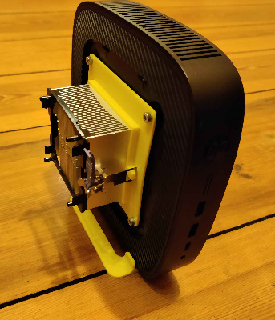
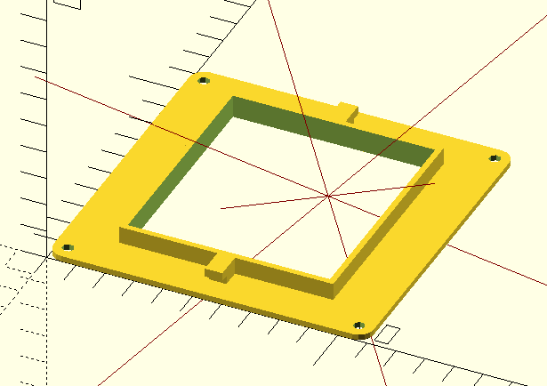

# HP T560 - CPU Cooler Attachment

I noticed that the T560 is getting very hot and throttles for some of the workloads I put it through.

It has holes for a VESA holder at the back and on the other side of the metal case is the Ryzen APU.

So I designed this holder to attach an old Socket AM2 CPU cooler to it. The original fan is broken but if nessecary it should be possible to add them quite easily (and equally jankily). The base of the cooler is 69mm wide and 77mm long. It should be enough, to change the variables *"cooler_width"* and *"cooler_length"* if you want to use another cooler. Also, it doesn't necessarily need to be an AM2 cooler. As long as it uses this classic hook style attachment, it should be fine.

